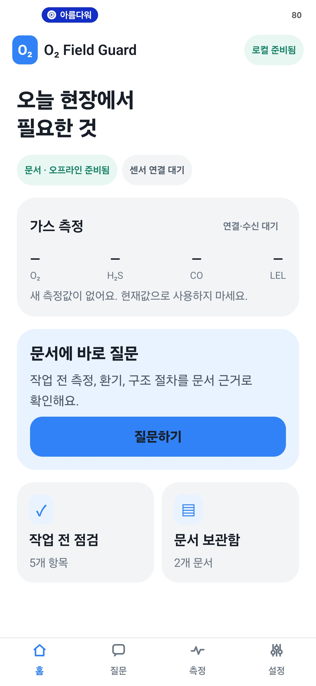
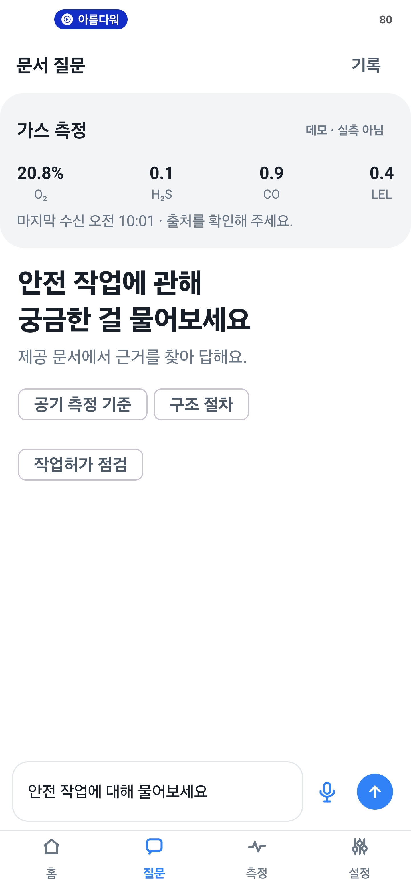
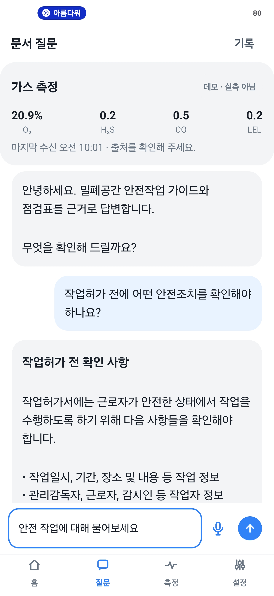
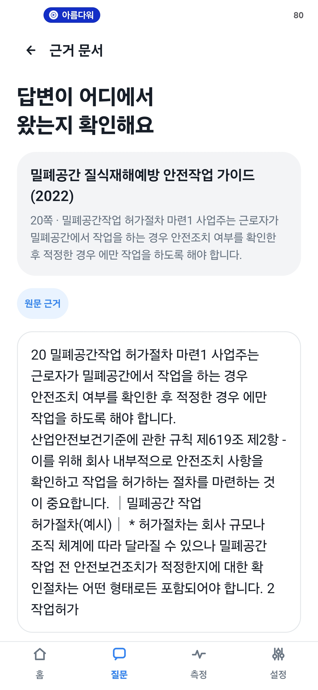
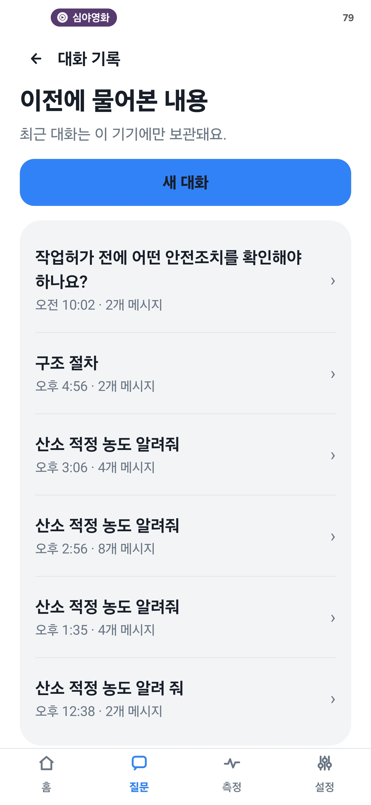
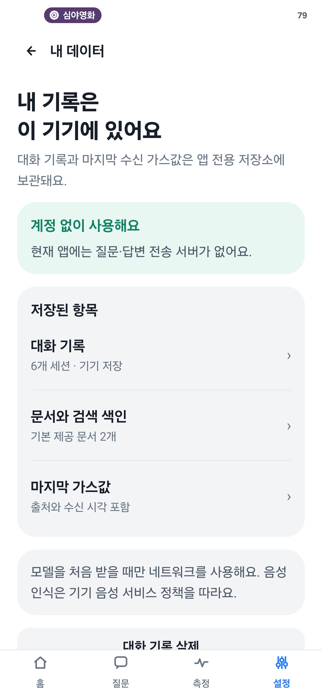
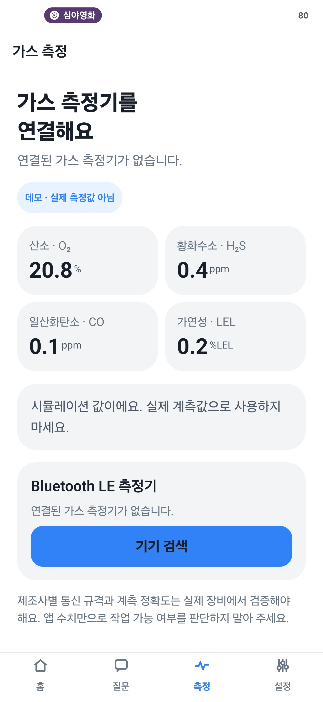
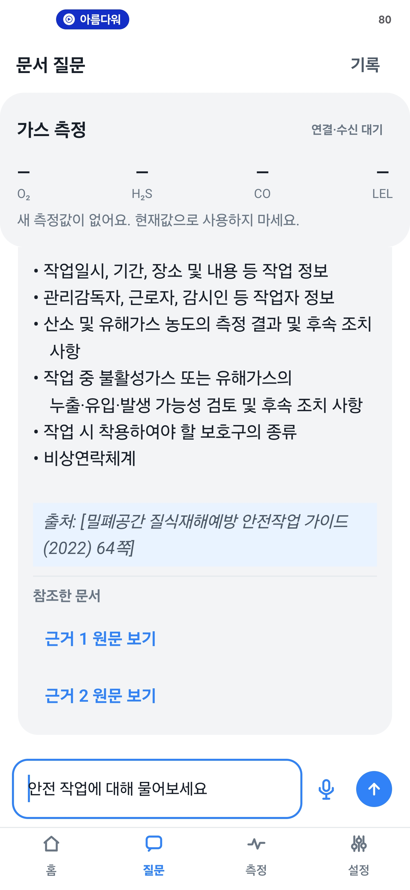
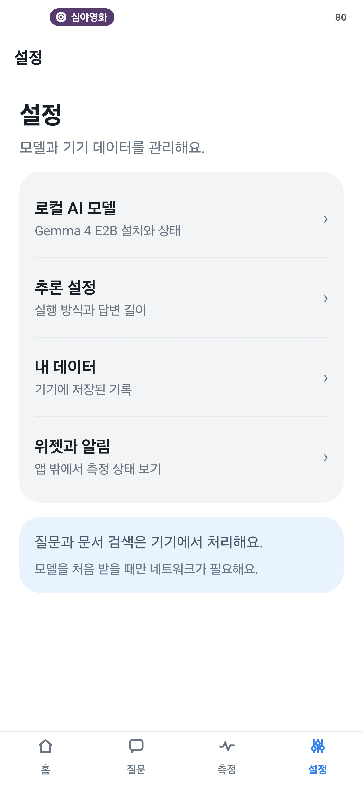
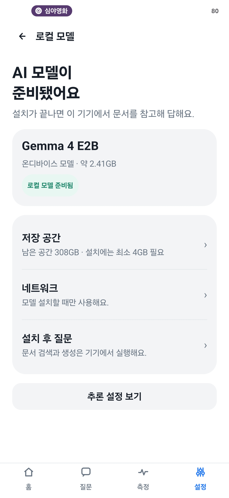

# O₂ Field Guard

**밀폐공간 안전작업을 위한 문서 질문·가스 측정 연동 Android 시안**

개발명: HybridTech O₂ Field Guard · Kotlin / Jetpack Compose

작업자가 현장에서 안전작업 관련 질문을 입력하면, 앱이 **기기에 저장된 문서에서 관련 쪽을 먼저 찾고** 그 근거를 바탕으로 답변합니다. 별도 탭에서는 Bluetooth LE 가스 측정기의 연결 및 O₂·H₂S·CO·LEL 수신 상태를 확인할 수 있습니다. 이 README는 방문 시연 시 화면과 개발 방식을 함께 설명하기 위한 자료입니다.

> [!IMPORTANT]
> 현재는 **시연용 시안**입니다. 첨부 화면의 `데모 · 실측 아님` 수치는 시뮬레이션이며, 실제 작업 가능 여부를 판단하는 측정값이 아닙니다. 범용 BLE 수신 기반은 구현했지만 특정 제조사의 측정기 프로토콜과 현장 정확도는 아직 검증하지 않았습니다.

## 1분 소개

| 현장에서 필요한 일 | 시안에서 보여주는 방식 |
| --- | --- |
| 안전 기준을 빨리 찾기 | 앱에 포함된 안전작업 문서 2종을 기기 안에서 검색하고, 답변 옆에 문서명과 쪽수를 연결합니다. |
| 인터넷이 불안정한 곳에서 질문하기 | 문서 검색은 기본적으로 오프라인입니다. Gemma 4 E2B를 한 번 내려받으면 답변 생성도 기기에서 수행합니다. |
| 가스 상태를 오해 없이 보기 | BLE 수신값과 시연용 값을 명확히 구분합니다. 새 수신이 없거나 오래된 값은 현재값처럼 표시하지 않습니다. |
| 작업 흐름을 이어서 보기 | 대화 기록·작업 전 점검 상태·마지막 가스값을 기기에 보관하고, 기본 제공 문서를 오프라인으로 엽니다. |

### 방문 시연 순서 (약 5분)

| 순서 | 화면에서 할 일 | 설명할 핵심 |
| --- | --- | --- |
| 1 | **홈**에서 문서·모델·센서 상태 확인 | 문서 검색과 가스 측정이 한 앱 안에 있지만, 값의 출처는 구분합니다. |
| 2 | **질문**에서 `작업허가 전에 어떤 안전조치를 확인해야 하나요?` 입력 | 질문과 관련된 문서 조각을 먼저 찾습니다. |
| 3 | 답변 아래 **근거 원문 보기** 선택 | 답변을 문서명·쪽수·원문과 대조할 수 있습니다. |
| 4 | **기록 / 내 데이터** 이동 | 대화와 마지막 수신값이 이 기기에 저장되는 범위를 보여줍니다. |
| 5 | **측정**에서 기기 검색과 데모 표시 확인 | 실제 측정기 연결은 장비 규격을 받아 연동·검증해야 합니다. |
| 6 | **설정 → 로컬 AI 모델** 확인 | 문서 검색은 모델 없이도 가능하고, 답변 생성은 모델을 한 번 내려받은 뒤 기기에서 실행됩니다. |

## 화면으로 보는 시안

아래는 보내주신 실제 화면 캡처 10장입니다. 이미지를 누르면 원본 크기로 볼 수 있습니다. 캡처 상단의 다른 앱 배지와 숫자는 시연 단말에 함께 표시된 요소로, O₂ Field Guard의 기능 설명 대상이 아닙니다. 화면의 수치·모델 상태·기록 개수는 **촬영 당시 단말 상태**입니다.

### 1. 홈에서 시작해 질문하기

| 홈: 오늘 확인할 항목 | 질문: 현장 질문 입력 |
| --- | --- |
| <a href="docs/screenshots/home.png"></a> | <a href="docs/screenshots/question-start.png"></a> |
| 문서 준비 상태와 센서 연결 대기를 먼저 보여주고, 질문·점검·문서 보관함으로 이동합니다. | 텍스트나 마이크로 질문할 수 있습니다. 공기 기준·구조 절차·작업허가 점검 같은 빠른 질문도 제공합니다. |

### 2. 답변의 근거 확인하기

| 질문과 답변 | 근거 문서 원문 |
| --- | --- |
| <a href="docs/screenshots/question-answer.png"></a> | <a href="docs/screenshots/source-document.png"></a> |
| 질문, 답변, 상단 가스 상태가 한 화면에 나타납니다. 답변 아래 근거를 열 수 있습니다. | 문서 제목과 쪽수, 검색된 원문을 표시합니다. 담당자가 실제 문장과 답변을 대조할 수 있습니다. |

### 3. 기록과 내 데이터 확인하기

| 대화 기록 | 내 데이터 |
| --- | --- |
| <a href="docs/screenshots/conversation-history.png"></a> | <a href="docs/screenshots/my-data.png"></a> |
| 이전 질문을 다시 열거나 새 대화를 시작합니다. | 대화, 문서 색인, 마지막 가스값의 저장 범위를 안내합니다. 현재 질문·답변 전송 서버는 없습니다. |

### 4. 측정값과 출처 구분하기

| 가스 측정 탭 | 질문 화면 상단 가스 상태 |
| --- | --- |
| <a href="docs/screenshots/gas-measurement.png"></a> | <a href="docs/screenshots/chat-gas-status.png"></a> |
| O₂·H₂S·CO·LEL과 BLE 기기 검색을 보여줍니다. 예시 수치는 `데모 · 실제 측정값 아님`으로 표시됩니다. | 새 수신이 없으면 숫자를 `—`로 가리고 사용 금지를 안내합니다. 문서 질문 중에도 측정 상태를 볼 수 있습니다. |

### 5. 모델과 추론 방식 살펴보기

| 설정 | 로컬 AI 모델 |
| --- | --- |
| <a href="docs/screenshots/settings.png"></a> | <a href="docs/screenshots/local-model.png"></a> |
| 모델·추론 설정·내 데이터·위젯과 알림을 분리해 제공합니다. | 화면은 해당 시연 기기에 모델이 준비된 상태를 보여줍니다. 다른 기기에서는 최초 다운로드와 충분한 저장 공간이 필요합니다. |

## 어떻게 개발했나

| 단계 | 구현 방법 | 이렇게 설계한 이유 |
| --- | --- | --- |
| 1. 문서 준비 | 제공된 안전작업 가이드와 자율점검표의 텍스트를 쪽 단위 87개 조각으로 정리해 앱 자산에 포함했습니다. | 답변이 어느 문서의 몇 쪽에서 왔는지 추적하기 위해서입니다. 원본 PDF 파일 자체는 APK에 넣지 않았습니다. |
| 2. 로컬 검색 | 첫 실행 때 조각을 ObjectBox에 저장하고, 384차원 해시 벡터 검색과 단어 일치 점수를 결합합니다. | 모델을 설치하기 전에도 관련 원문을 찾고, 연결이 없는 곳에서도 검색하기 위해서입니다. |
| 3. 기기 내 답변 | 상위 근거 2개를 Gemma 4 E2B 프롬프트에 넣어 LiteRT-LM으로 답변을 생성합니다. 모델이 없거나 실패하면 검색된 원문을 보여줍니다. | 생성 답변을 제공 문서에 묶고, 실패해도 근거 확인 경로를 남기기 위해서입니다. |
| 4. 가스 측정 분리 | BLE Notify/Indicate 수신기, 패킷 파서, 마지막 수신 시각·출처 저장소를 구현했습니다. 별도 시뮬레이션 서비스는 시연용으로만 사용합니다. | 실제 장비값과 가상값을 혼동하지 않게 하기 위해서입니다. |
| 5. 현장 화면 | Jetpack Compose로 홈·질문·근거·측정·설정 흐름을 만들고, `StateFlow`로 상태를 한곳에서 관리합니다. | 작업자가 필요한 화면을 빠르게 찾고 연결 상태 변화를 즉시 볼 수 있게 하기 위해서입니다. |
| 6. 기기별 안전 장치 | 모델은 WorkManager로 내려받고, GPU 초기화가 실패하면 CPU를 시도합니다. 60초 이상 지난 가스값은 현재값으로 취급하지 않습니다. | 큰 모델과 불안정한 무선 연결을 현장 화면에서 안전하게 다루기 위해서입니다. |

자세한 검색·모델·BLE 구현은 아래 [기술 설명](#오프라인-rag-구조)과 [프로젝트 구조](#프로젝트-구조)에서 확인할 수 있습니다.

## 구현 상태

| 영역 | 구현 내용 | 상태 |
| --- | --- | --- |
| 문서 RAG | 제공 문서 2종의 텍스트 87개 조각을 ObjectBox에 저장하고 오프라인 검색 | 구현됨 |
| 근거 문서 보기 | 문장·목록을 읽기 쉽게 구분한 보기와 추출 원문 그대로 보기 전환 | 구현됨 — 화면 표시만 변경 |
| 로컬 생성 AI | Gemma 4 E2B LiteRT-LM 모델 다운로드·저장·CPU/GPU 폴백 생성 | 구현됨 |
| 채팅 | Markdown 답변, 대화 이력, 새 대화, 최근 답변 이동 | 구현됨 |
| 앱 UI | 카드 중심 Compose 화면, 하단 탭과 키보드 여백 처리 | 구현됨 |
| 음성 입력 | 마이크 버튼, Android 음성 인식, 시스템 음성 입력 폴백, `오투야` 호출 대기 UI | 구현됨 — 기기 음성 서비스에 따라 동작 여부가 달라짐 |
| BLE 가스 연동 | BLE 검색·연결·Notify/Indicate 수신·일반 텍스트 패킷 파싱 | 기반 구현됨 — 제조사 프로토콜 연동 필요 |
| 가스 시뮬레이션 | 안정 범위의 임의 O₂/H₂S/CO/LEL 값, 20초 주기 갱신 | 구현됨 — 데모 전용 |
| 백그라운드 표시 | 포그라운드 서비스 알림 카드와 홈 화면 앱 위젯 | 구현됨 |
| 설정 | 모델 관리, 추론 백엔드, 문맥 한도, 자동 답변 길이와 수동 상한, 설정 영속화 | 구현됨 |

## 핵심 화면

- **온보딩·홈**: 로컬 처리 범위를 안내하고 질문, 가스 측정, 작업 전 점검, 문서 보관함으로 이동합니다.
- **현장 채팅·음성 질문**: 질문 입력, 빠른 질문, 음성 입력, Markdown 답변, 최근 답변으로 이동 버튼을 제공합니다. 음성 답변은 핵심 내용 위주로 짧게 읽고 전체 답변과 근거는 화면에 남깁니다.
- **근거 원문**: 답변에 사용된 문서 조각과 쪽수를 열고 같은 문서의 이전·다음 부분을 볼 수 있습니다.
- **대화 기록**: 최근 20개 세션과 세션별 최대 80개 발화(질문·답변)를 기기에 보관합니다. 대화 내용은 `SharedPreferences`에만 저장됩니다.
- **센서·연결 끊김**: BLE 검출기 검색·연결·연결 해제와 최근 수신값을 보여 줍니다. 연결이 끊기거나 60초 이상 수신되지 않은 값은 현재값으로 표시하지 않습니다.
- **작업 전 점검·문서 보관함**: 5개 점검 항목을 기기에 보관하고, 기본 제공 문서의 원문 조각을 오프라인으로 검색합니다.
- **설정·데이터·위젯 안내**: 모델 다운로드와 추론 방식, 기록 삭제, 위젯과 알림 상태를 확인합니다.
- **상단 가스 카드**: 유효한 최근 가스값과 출처(BLE/시뮬레이션)를 채팅 상단에서 확인할 수 있습니다.

### Compose 화면 구조

`MainActivity`는 Compose 진입점과 Android 권한 요청을 담당합니다. `FieldGuardViewModel`은 `StateFlow`로 대화, 모델 다운로드, 추론 설정, 가스 측정값과 BLE 검색 상태를 노출하고, `TossFieldGuardApp`은 상태를 화면에 표시하며 사용자 이벤트를 ViewModel에 전달합니다. 음성 인식과 TTS는 `VoiceConversationController`가 관리합니다.

온보딩 이후에는 상세 화면을 포함한 모든 앱 화면에 하단 탭을 표시합니다. 키보드 입력 중에는 채팅 입력창을 가리지 않도록 탭을 잠시 숨깁니다.

채팅은 `LazyColumn`으로 메시지를 표시하고, 하단 입력창에 `imePadding`을 적용합니다. 목록을 위로 스크롤하면 **최근 답변으로** 버튼이 나타납니다. 모델 답변은 Compose `AnnotatedString` 렌더러로 제목·목록·굵게·인라인 코드·출처를 표시합니다. 브랜드 색상은 고정이며 Android 동적 색상은 사용하지 않습니다.

위젯과 가스 알림은 Android `RemoteViews`가 필요하므로 앱과 같은 색상 체계의 XML 레이아웃으로 맞췄습니다. 문서 검색, 모델 추론, BLE 패킷 해석과 다운로드 경로는 별도 계층으로 유지합니다.

## 오프라인 RAG 구조

Gemma가 PDF를 직접 여는 방식이 아니라, 앱이 먼저 관련 문서 조각을 검색하고 그 근거를 Gemma 프롬프트에 넣는 구조입니다.

```text
PDF 텍스트 추출본(JSON)
  └─ 2개 문서 / 87개 청크
       └─ ObjectBox 저장
            ├─ 본문·제목·페이지·검색 텍스트
            └─ 384차원 로컬 검색 벡터

사용자 질문(텍스트 또는 음성 인식 텍스트)
  └─ 동일한 384차원 벡터 생성
       └─ ObjectBox HNSW 최근접 벡터 검색
            + 단어 일치 점수 재정렬
                 └─ 상위 PDF 근거 2개
                      └─ [근거 + 질문]을 Gemma 4 E2B에 전달
                           └─ Markdown 답변
```

### 포함 문서

| 문서 | 청크 수 | 용도 |
| --- | ---: | --- |
| `밀폐공간 질식재해예방 안전작업 가이드 (2022)` | 84 | 환기, 측정, 보호구, 작업·구조 안전 기준 등의 상세 근거 |
| `밀폐공간 질식사고 위험작업 자율점검표` | 3 | 현장 점검 항목과 사전 확인 근거 |

문서 원본에서 추출한 데이터는 [`app/src/main/assets/knowledge/seed_chunks_v1.json`](app/src/main/assets/knowledge/seed_chunks_v1.json)에 포함됩니다. 앱 첫 실행 시 `KnowledgeSeeder`가 이 데이터를 ObjectBox에 적재합니다. 시드 버전이 같고 청크 수가 유지되면 재적재하지 않습니다.

### 검색·답변 생성 흐름

1. 채팅 입력과 음성 인식 결과는 모두 `FieldGuardViewModel.submitQuestion()`으로 들어갑니다.
2. `KnowledgeRepository.retrieve()`가 질문을 384차원 로컬 해시 임베딩으로 바꿉니다.
3. ObjectBox의 HNSW 코사인 최근접 검색 결과와 `searchableText` 단어 일치도를 합칩니다.
   - 벡터 유사도: **72%**
   - 단어 일치도: **28%**
4. 상위 근거 2개의 원문 조각을 문서명·쪽수와 함께 Gemma에 전달합니다. 페이지 중간의 조건이나 수치가 잘리지 않도록 조각 본문 전체를 사용하며, 근거 화면에서도 같은 원문을 볼 수 있습니다.
   - 근거 화면의 **읽기 편한 보기**는 문장과 원문 목록 기호를 구분해 표시합니다. **원문 그대로**로 즉시 전환할 수 있으며, 저장된 문서와 모델에 전달하는 근거는 바뀌지 않습니다.
5. Gemma는 “검색 문서만 근거로, 수치·단위·이상/미만을 정확히” 답하도록 프롬프트를 받습니다.
6. 기본값은 앱에서 별도 출력 토큰 상한을 지정하지 않고 모델이 답변을 마칠 때까지 생성합니다. 생성 중에는 약 200ms 간격으로 텍스트를 표시하고, 완료 후 Markdown 형식과 참조 문서 링크를 표시해 기록에 저장합니다.
7. 모델이 준비되지 않았거나 생성이 실패하면, 같은 검색 결과를 문서 근거와 페이지 출처로 바로 표시합니다.

현재 임베딩은 앱 용량과 초기 실행 부담을 낮추기 위한 `OfflineHashEmbedding`입니다. 즉, 생성 모델인 Gemma 4 E2B와 별도의 대형 문장 임베딩 모델은 아직 탑재하지 않았습니다. 표현이 크게 달라지는 질문의 의미 검색 정확도를 더 높여야 한다면, 향후 임베딩 전용 온디바이스 모델로 교체하는 것이 다음 개선 지점입니다.

### RAG 관련 주요 파일

| 파일 | 역할 |
| --- | --- |
| [`KnowledgeRepository.kt`](app/src/main/java/com/minyook/sllm2/data/KnowledgeRepository.kt) | ObjectBox 벡터·키워드 하이브리드 검색, 모델 폴백 근거 생성 |
| [`KnowledgeSeeder.kt`](app/src/main/java/com/minyook/sllm2/data/KnowledgeSeeder.kt) | 번들 PDF 청크를 최초 1회 DB에 적재 |
| [`KnowledgeChunk.kt`](app/src/main/java/com/minyook/sllm2/data/KnowledgeChunk.kt) | ObjectBox 엔터티와 HNSW 벡터 인덱스 정의 |
| [`OfflineHashEmbedding.kt`](app/src/main/java/com/minyook/sllm2/data/OfflineHashEmbedding.kt) | 질문·문서 공통 384차원 로컬 임베딩 |
| [`LocalModelRuntime.kt`](app/src/main/java/com/minyook/sllm2/model/LocalModelRuntime.kt) | 검색 근거를 포함한 Gemma 프롬프트 구성과 로컬 생성 |

## Gemma 4 E2B 모델 관리

앱 APK에 약 2GB 이상 모델을 포함하지 않습니다. 설정 화면의 **앱에서 다운로드**를 누르면 `WorkManager`가 고유 작업으로 다운로드를 시작합니다.

- 대상 모델 파일: `gemma-4-e2b-it.litertlm`
- 저장 위치: 앱의 `noBackupFilesDir/models/`
- 다운로드 중: 포그라운드 알림과 진행률 표시
- 재시작 후: 파일 크기와 저장된 상태를 확인해 준비 상태를 복원
- 추론 엔진: LiteRT-LM
- 백엔드: 자동(GPU 우선), GPU 우선(실패 시 CPU), CPU 안전 모드
- 엔진 생성 실패: 다른 백엔드로 순차 폴백

### 기기 성능 기반 토큰 설정

모바일 기기는 모델·Android·GPU 드라이버의 메모리를 함께 사용합니다. 앱은 총 RAM과 저메모리 상태를 보고 문맥 상한을 정합니다.

| 기기 RAM | 앱 문맥 상한 |
| --- | ---: |
| 6GB 미만 또는 저메모리 기기 | 2,048 토큰 |
| 6GB 이상 ~ 8GB 미만 | 4,096 토큰 |
| 8GB 이상 ~ 12GB 미만 | 8,192 토큰 |
| 12GB 이상 ~ 16GB 미만 | 16,384 토큰 |
| 16GB 이상 ~ 24GB 미만 | 24,576 토큰 |
| 24GB 이상 | 32,768 토큰 |

**답변 길이 자동**이 기본값입니다. 이때 앱은 별도의 출력 토큰 상한을 전달하지 않고 모델의 종료 신호까지 생성합니다. 다만 모델과 기기의 문맥 크기는 유한하므로 모든 길이를 무제한으로 보장하지는 않습니다. 수동 길이 설정을 켠 경우에만 선택한 상한을 적용하며, 긴 답변은 그 상한에서 끊길 수 있습니다.

### 실제 기기에서 답변 속도 확인

Android Studio Logcat에서 `FieldGuardInference`를 검색하거나 `adb logcat -s FieldGuardInference:I`로 측정값을 볼 수 있습니다. `backend`는 실제 사용한 CPU/GPU, `initMs`는 모델 준비, `firstChunkMs`는 첫 출력까지, `streamMs`는 첫 출력부터 마지막 출력까지, `tailMs`는 마지막 출력 뒤 완료 처리까지 걸린 시간입니다. `outputLimit=model-default`는 자동 길이 설정을 뜻하며 질문·답변 원문은 로그에 남기지 않습니다. 같은 질문을 여러 번 실행해 CPU/GPU 방식별 속도와 답변 완결성을 비교해야 합니다.

## BLE 가스 검출기와 백그라운드 모니터링

### BLE 연결 흐름

1. 센서 연결 화면에서 Bluetooth 권한을 요청하고 주변 BLE 기기를 검색합니다.
2. 사용자가 기기를 선택하면 GATT 연결 후 Notify 또는 Indicate 가능한 특성(characteristic)을 구독합니다.
3. 수신 데이터는 `GasPacketParser`가 아래 형식으로 해석합니다.

```text
JSON:      {"o2":20.9,"h2s":0.0,"co":0.0,"lel":0.0}
Key-value: O2=20.9,H2S=0.0,CO=0.0,LEL=0.0
CSV:       20.9,0.0,0.0,0.0
```

4. 파싱된 값은 앱 내부 저장소에 마지막 수신 시각·기기명·출처와 함께 보관됩니다.
5. `GasMonitoringService`가 포그라운드 서비스로 유지되며, 알림 패널과 앱 UI를 갱신합니다.

지원 채널은 O₂(%), H₂S(ppm), CO(ppm), LEL(%)입니다. 현재는 UUID나 제조사 바이너리 프레임을 고정하지 않은 범용 수신기이므로, 실제 장비를 붙일 때는 해당 제조사의 서비스 UUID·특성 UUID·단위·CRC·경보 상태 규격을 `BleGasClient`에 반영해야 합니다.

### 데모 시뮬레이션

모델 준비 이후 실제 BLE 측정이 없는 상황에서는 `GasSimulationService`가 안정 범위의 임의 가스값을 20초마다 발행할 수 있습니다. 화면·알림에는 반드시 **데모 시뮬레이션 / 실제 측정값 아님**으로 구분됩니다. 실제 BLE 수신이 시작되면 BLE 값이 우선합니다.

### 알림·위젯

- **알림 패널**: 포그라운드 서비스의 맞춤 카드에 O₂, H₂S, CO, LEL, 수신 시각을 표시합니다.
- **홈 화면 위젯**: `GasWidgetProvider`가 마지막 저장 가스값을 표시합니다.
- 알림과 위젯은 60초 이내에 수신된 값만 현재값으로 표시합니다. 수신이 멈추면 숫자를 숨기고 상태를 안내합니다.

> Android의 알림/위젯 표시 방식은 제조사 런처와 OS 버전에 따라 다를 수 있습니다. Android 13 이상에서는 알림 권한이 필요합니다.

## 음성 입력

- 전송 버튼 옆 마이크 버튼으로 Android `SpeechRecognizer`를 시작합니다.
- 음성 인식 결과는 일반 텍스트 질문과 **같은 RAG 경로**로 전달됩니다.
- 시스템 음성 입력 Intent를 폴백으로 사용합니다.
- `오투야` 호출 대기 상태를 UI에서 켤 수 있습니다.

음성 인식 엔진은 기기 제조사, 설치된 Google 앱/음성 서비스, 언어팩, 네트워크·오프라인 음성팩 상태에 영향을 받습니다. 따라서 RAG와 Gemma 추론은 로컬이더라도 음성 인식 자체가 모든 기기에서 완전 오프라인으로 보장되지는 않습니다.

## 권한과 로컬 데이터

| 권한 | 용도 |
| --- | --- |
| `INTERNET` | 최초 Gemma 모델 다운로드 |
| `POST_NOTIFICATIONS` | 모델 다운로드·가스 모니터링 알림 |
| `RECORD_AUDIO` | 음성 질문 입력 |
| `BLUETOOTH_SCAN`, `BLUETOOTH_CONNECT` | BLE 검출기 검색·연결 |
| Foreground Service | 장시간 모델 다운로드와 가스 모니터링 |

앱은 문서 청크, RAG 벡터 DB, 채팅 이력, 모델 설정, 마지막 가스값을 앱 전용 저장소에 보관합니다. 현재 구현에는 사용자 질의·채팅·가스 데이터를 별도 서버로 전송하는 API가 없습니다.

## 프로젝트 구조

```text
app/
├─ objectbox-models/                 # ObjectBox 스키마
├─ src/main/assets/knowledge/         # PDF 텍스트 청크 시드
├─ src/main/java/com/minyook/sllm2/
│  ├─ MainActivity.kt                # Compose 진입점과 Android 권한 요청
│  ├─ ui/                            # Material 3 화면, 상태·이벤트, 음성 제어, Markdown
│  ├─ data/                          # ObjectBox RAG, 문서 시드, 채팅 이력
│  ├─ model/                         # Gemma 다운로드·상태·LiteRT 추론·설정
│  └─ gas/                           # BLE, 가스 파서, 서비스, 알림, 위젯
├─ src/main/res/                     # 색상, 아이콘, 알림·위젯 RemoteViews XML
├─ src/test/                         # JVM 단위 테스트
└─ src/androidTest/                  # Compose 화면 테스트
```

## 빌드 및 실행

### 요구 사항

- Android Studio 최신 안정판
- Android SDK 37
- 최소 Android API 26 (Android 8.0)
- Gradle 데몬용 JDK 25 (`gradle/gradle-daemon-jvm.properties`에 지정, 자동 설치 가능), 앱 Java/Kotlin 바이트코드 대상 11

### Android Studio

1. 이 저장소를 Android Studio에서 엽니다.
2. Gradle 동기화를 완료합니다.
3. 실제 Android 기기 또는 에뮬레이터를 선택합니다.
4. `app`을 실행합니다.
5. 설정 화면에서 Gemma 모델을 다운로드하고 준비 상태가 될 때까지 기다립니다.

### 명령줄

Windows PowerShell에서 다음 명령을 실행합니다.

```powershell
.\gradlew.bat :app:assembleDebug
.\gradlew.bat :app:testDebugUnitTest
.\gradlew.bat :app:compileDebugAndroidTestKotlin
```

생성 APK 경로:

```text
app/build/outputs/apk/debug/app-debug.apk
```

디버그 APK 빌드와 JVM 테스트, Compose UI 테스트 소스 컴파일로 기본 회귀를 확인합니다. 실제 기기에서 실행하는 계측 테스트와 BLE 수신, 음성 인식, 키보드/IME, 모델 복원, 위젯 갱신은 별도로 확인해야 합니다.

## 방문 시 함께 확인할 사항

| 결정할 내용 | 필요한 이유 |
| --- | --- |
| 연동할 가스 측정기의 제조사·모델·통신 규격 | 실제 BLE 패킷과 단위, 경보 및 연결 끊김 동작을 해당 장비에 맞춰 구현·시험해야 합니다. |
| 사용 문서의 최종본과 개정 담당자 | 답변 근거로 쓰는 문서의 버전과 쪽수를 관리하고 변경 시 색인을 다시 만들어야 합니다. |
| 시범 운영 기기와 작업 환경 | 모델 속도, 저장 공간, 음성 인식, 백그라운드 동작, 통신 상태를 대상 단말에서 확인해야 합니다. |
| 데이터 보관·삭제 및 알림 운영 기준 | 대화·점검 기록의 보관 범위와 측정 알림 책임을 현장 운영 방식에 맞춰 정해야 합니다. |

## 상용화 전 우선 과제

1. **실측 BLE 프로토콜 확정**: 제조사별 UUID, 바이너리 프레임, CRC, 단위, 경보 플래그, 통신 재연결 정책을 반영합니다.
2. **안전 검증**: 교정된 검출기와 실제 현장 조건에서 알림 지연, 백그라운드 지속성, 통신 단절, 권한 거부, 저전력 모드를 검증합니다.
3. **모델 배포 보안**: 현재 모델 다운로드 주소를 운영용 서명 CDN/매니페스트·SHA-256 검증·버전 롤백 정책으로 교체합니다.
4. **RAG 평가 체계**: 대표 질문 세트와 정답 페이지를 만들고, 검색 상위 근거·수치 정확도·환각률을 자동 회귀 테스트로 관리합니다.
5. **문장 임베딩 고도화**: 해시 임베딩을 한국어 지원 온디바이스 임베딩 모델로 교체해 동의어·구어체 검색 품질을 개선합니다.
6. **음성 오프라인화**: 지원 기기에서 오프라인 한국어 음성팩을 검증하거나 별도 온디바이스 STT 엔진을 도입합니다.

## 참고

- 현재 UI·RAG·가스 시뮬레이션은 현장 작업 보조를 위한 구현입니다.
- 실제 작업 허가, 입장 여부, 대피 판단은 사업장 안전관리 체계와 법정 기준, 검교정된 측정기를 우선해야 합니다.
